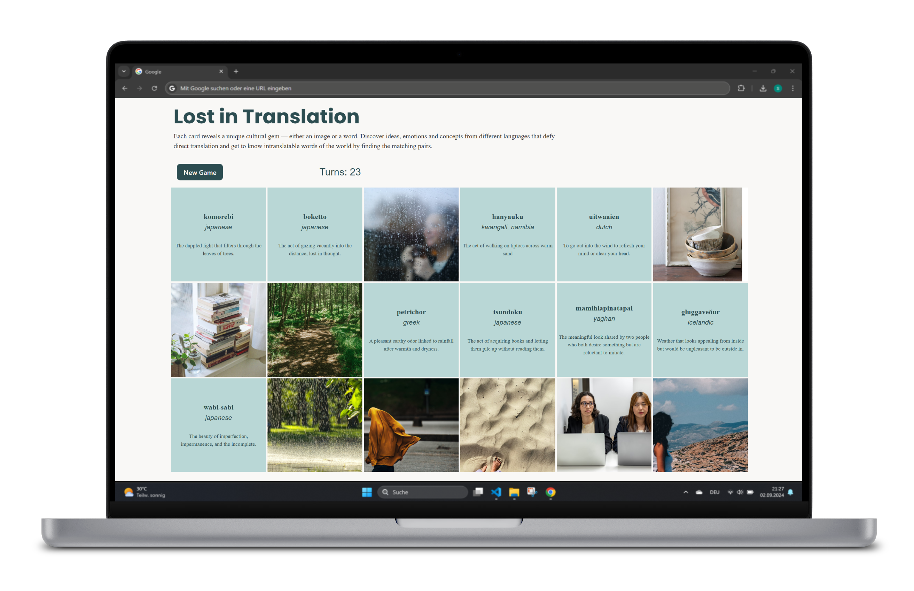

# Lost in Translation

🔗 [Live Demo](https://lostintranslation.netlify.app/)

A memory card game built with React, TypeScript, and Tailwind CSS.

Each card reveals either an image or a word. The goal is to find matching pairs — connecting illustrated concepts with their untranslatable names from languages around the world.



---

## Concepts Featured

| Word | Language | Meaning |
|------|----------|---------|
| Boketto | Japanese | Gazing vacantly into the distance, lost in thought |
| Gluggaveður | Icelandic | Weather that looks nice from inside but is unpleasant to be out in |
| Hanyauku | Kwangali (Namibia) | Walking on tiptoes across warm sand |
| Komorebi | Japanese | Dappled light filtering through tree leaves |
| Mamihlapinatapai | Yaghan | A look shared by two people who both want something but neither wants to initiate |
| Petrichor | Greek | The pleasant earthy smell after rain following warmth and dryness |
| Tsundoku | Japanese | Buying books and letting them pile up unread |
| Uitwaaien | Dutch | Going out into the wind to clear your head |
| Wabi-sabi | Japanese | The beauty of imperfection, impermanence, and the incomplete |

---

## Tech Stack

- [React 18](https://react.dev/)
- [TypeScript](https://www.typescriptlang.org/)
- [Vite](https://vitejs.dev/)
- [Tailwind CSS](https://tailwindcss.com/)

---

## Getting Started

### Prerequisites

- Node.js 18+
- npm

### Installation

```bash
git clone https://github.com/Sebastian-Weber/words-images-matching-game.git
cd words-images-matching-game/frontend
npm install
npm run dev
```

Open [http://localhost:5173](http://localhost:5173) in your browser.

---

## How to Play

1. Cards are placed face-down on the board
2. Click a card to reveal it
3. Click a second card to find its match
4. A match: both cards stay revealed
5. No match: cards flip back after a short pause
6. Find all 9 pairs in as few turns as possible
7. Click **New Game** to shuffle and restart

---

## Project Structure

```
frontend/
├── src/
│   ├── assets/images/    # Card illustrations
│   ├── components/
│   │   └── SingleCard.tsx
│   ├── App.tsx
│   └── main.tsx
├── index.html
├── tailwind.config.js
└── vite.config.ts
```

---

## License

MIT
